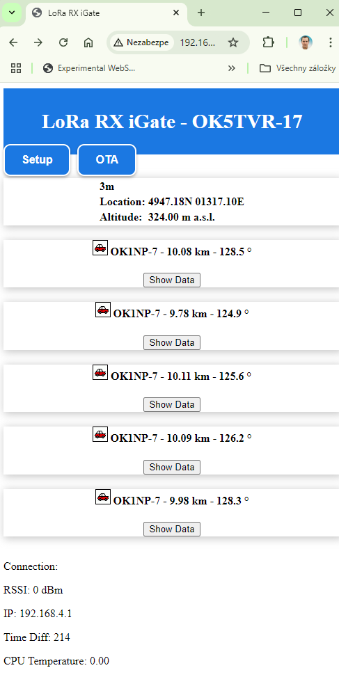

# Supported Boards

The firmware supports several ESP32-based LoRa boards. Pin mappings are handled via board_pins.h and build_flags in platformio.ini.

TTGO LoRa32 V1 / V2
TTGO T-Beam
Heltec WiFi LoRa 32 (V2)

Select your board in platformio.ini (e.g. -DBOARD_TTGO_V1, -DBOARD_TBEAM, -DBOARD_HELTEC, -DBOARD_GENERIC).
# Version 2.2.00
Overview
Version 2.2.00 adds dynamic LoRa configuration and secures the web interface and OTA updates with user-defined credentials.
Changes
1. Dynamic LoRa Configuration

Added web interface dropdowns for LoRa settings:

Spreading Factor (6–12)
Bandwidth (7800–500000 Hz)
Coding Rate (5–8)

Updated nastaveni_html, procesor, loadConfiguration, and server.on("/nastaveni", HTTP_POST, ...) to handle and store settings in config.txt.
Modified setupLoRa to apply LoRa parameters dynamically.

2. Web and OTA Authentication

Added HTTP Basic Authentication for /nastaveni and /update endpoints.
Included web_username and web_password fields in nastaveni_html and config.txt.
Updated procesor, loadConfiguration, and setupWebServer to support authentication.
Configured AsyncElegantOTA to require credentials for OTA updates.
Ensured minimum 4-character password length (defaults to "admin").

Notes

Config File: config.txt now uses 26 parameters. Add <admin><admin> at the start for compatibility.
Testing: Confirm LoRa settings apply correctly and authentication prompts appear for /nastaveni and /update.
Security: Passwords are stored in plain text. Consider hashing for future enhancements.

# Enhanced Map Display for LoRa RX iGate
The LoRa RX iGate firmware has been updated (version 2.1.12) to include an enhanced map display feature. The map now shows the last five received stations from the buffers (buffer, buffer_lat, buffer_lon, buffer_RSSI, buffer_SN, buffer_vzdalenost, buffer_azimut) using blue markers, while the iGate itself (call, lat, lon) is displayed with a red marker. Key improvements include:

Dynamic Station Data: Station data (callsign, RSSI, SNR, distance, azimuth) is defined in a <script> block before Leaflet initialization, ensuring compatibility with the procesor function without requiring JavaScript processing.
Preserved Functionality: All existing features (LoRa, APRS, Wi-Fi, OLED, configuration via config.txt) remain unchanged, with the map accessible in iGate mode (digi_mode = 0, digi_AP = 0).

This update improves the user interface and simplifies icon management while maintaining robust APRS and LoRa functionality. For details, see the updated map_html and procesor function in the source code.

# LoRa_RX_Igate Flasher
This is the web-based flasher for the LoRa_RX_Igate project. It allows you to flash firmware to your ESP32.
Access the flasher at: [https://ok5tvr.github.io/LoRa_RX_Igate/](https://ok5tvr.github.io/LoRa_RX_Igate/).
# LoRa_RX_Igate Update 3.8.2025

LoRa RX iGate/Digi is a program for ESP32-based devices that functions as a LoRa receiver, APRS iGate, or digipeater for radio communication in the 433 MHz band. It enables the reception and processing of APRS packets, forwarding them to an APRS-IS server (in iGate mode), relaying packets (in Digi mode), or operating as a Wi-Fi access point (AP mode). The program includes a web interface for displaying received data and configuring settings, an OLED display for showing information, and support for telemetry (e.g., CPU temperature, packet count). Version 2.1.11 adds the ability to edit the configuration via the web interface at /nastaveni (settings). Main Features:

- **LoRa Packet Reception** – Captures and decodes APRS packets on **433.775 MHz**.  
- **iGate Mode** – Forwards received packets to an **APRS-IS server** via Wi-Fi.  
- **Digi Mode** – Relays APRS packets via **LoRa** with support for aliases (e.g., **WIDE1-1**, **WIDE2-2**).  
- **AP Mode** – Creates a Wi-Fi access point for configuration **without an internet connection**.  
- **Web Interface** – Displays received packets, distance, azimuth, RSSI, S/N, and configuration options (SSID, password, callsign, GPS coordinates, etc.).  
- **OLED Display** – Shows status, IP address, callsign, and program version.  
- **Telemetry** – Sends information about packet count, distance, and CPU temperature.  
- **OTA Updates** – Supports firmware updates via the **web interface**.  

# LoRa_RX_Igate Update 4.6.2023
Added sending of the status text. Examples of GPS position settings: 

4903.50N is 49 degrees 3 minutes 30 seconds north.
In generic format examples, the latitude is shown as the 8-character string
ddmm.hhN (i.e. degrees, minutes and hundredths of a minute north). 
07201.75W is 72 degrees 1 minute 45 seconds west.
In generic format examples, the longitude is shown as the 9-character string
dddmm.hhW (i.e. degrees, minutes and hundredths of a minute west).

in config.txt
 lon <4903.50N>   lat <07201.75W>

# LoRa_RX_Igate Update 3.6.2023
Version 2.1.1 is available on GitHub. This version fixes the issue with IP address assignment using the DHCP server. In the settings, the option "IP_manual <true>" corresponds to a static IP address, while "IP_manual <false>" corresponds to automatic IP address assignment.

# LoRa_RX_Igate Update 2.6.2023
With the update to version 2.1.0, the configuration from the config.txt file is fully functional. You can modify the igate settings by changing the configuration in the txt file. The desired values must be enclosed in "<>". The end of the file is marked with "!".

# LoRa_RX_Igate Update 1.6.2023
This update enables OTA updates through a web interface. The address is the IP address of the device followed by "/update". Additionally, it is possible to configure a static or DHCP-assigned address in the settings. The address will be displayed on the home screen. The configuration is done on line 44 of the code ("bool pouzitPevnouIP = true;") where false corresponds to DHCP. Preparation is underway to extract the settings from the base code using SPIFFS.h. Therefore, before the initial launch via PlatformIO, it is necessary to upload the "config.txt" file using PlatformIO --> Upload Filesystem Image.
 <b>Please perform the configuration in the source code.</b>

# LoRa_RX_Igate Update 28.5.2023
In the update, code for sending telemetry to the APRS network has been added. An option for decoding compressed location from an APRS packet has been included. Basic icons can be decoded from APRS packets, and they are displayed on the igate website.
# LoRa_RX_Igate Update 22.5.2023
Simple LoRa Igate. The Igate operates using the LoRa.h library. Upon receiving a packet, it undergoes editing, checking, and is subsequently sent to an APRS server. The Igate includes safeguards against communication failure via Wi-Fi and connection drops between the Igate and the server. The Igate has a web interface with a fixed IP address that can be set by modifying it in Platformio. The website displays the five most recent stations with their respective distance and azimuth. Additionally, the RSSI and S/N parameters are shown. On the OLED display, five stations with their RSSI and SN are displayed
# LoRa_RX_Igate
Simple LoRa Igate. The Igate operates using the LoRa.h library. Upon receiving a packet, it undergoes editing, verification, and is subsequently sent to an APRS server. The Igate is equipped with safeguards against communication failure via WiFi and loss of connection between the Igate and the server.
